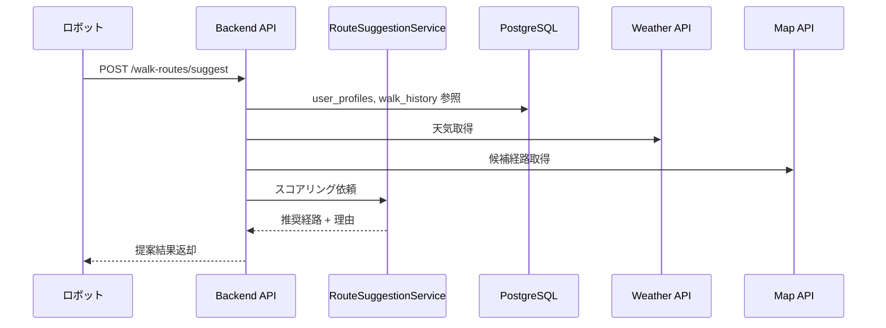
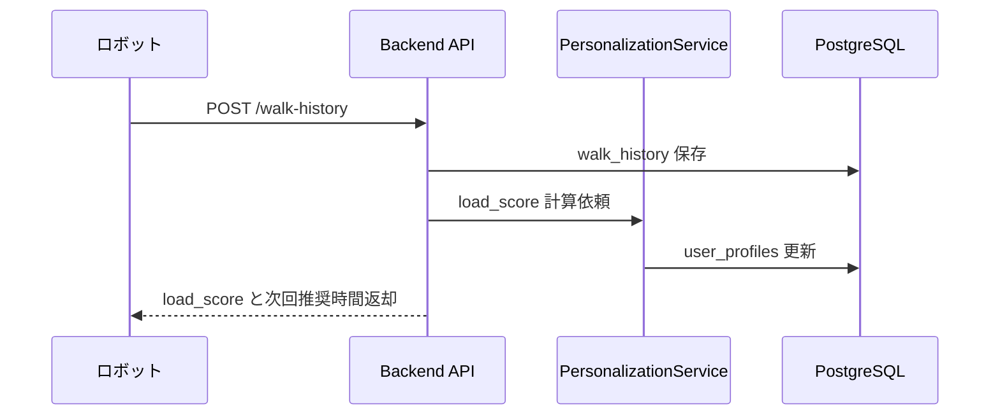
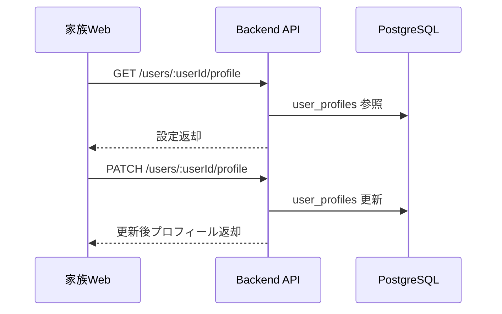

# API一覧とシステム接続定義

## 1. 目的

このドキュメントは、ロボット、本人向けUI、家族向けUI、バックエンドの間で、どの API をどこでどう扱うかを定義する。

MVP では、バックエンドは 1 つの TypeScript API サーバとして実装する前提。

## 2. 登場コンポーネント

### クライアント

- ロボットアプリ
- 本人向け簡易 UI
- 家族・介護者向け Web
- 管理者画面

### バックエンド内部

- API Controller
- RouteSuggestionService
- PersonalizationService
- MonitoringService
- UserProfileService

### データストア

- `users`
- `user_profiles`
- `walk_history`

### 外部 API

- Weather API
- Map / Routing API
- Gemini API

## 3. API の大分類

### 散歩前

- 今日の散歩提案取得
- ユーザープロファイル取得
- 定番コース一覧取得

### 散歩中

- 散歩開始通知
- 位置イベント送信
- 休憩イベント送信
- 異常イベント送信

### 散歩後

- 散歩完了登録
- 主観フィードバック登録
- user_profile 再計算

### 家族・介護者向け

- 現在状態取得
- 履歴一覧取得
- user_profile 更新
- アラート一覧取得

## 4. API 一覧

## 4.1 散歩前 API

### `POST /api/v1/walk-routes/suggest`

今日の散歩提案を返す中核 API。

| 項目 | 内容 |
|---|---|
| 呼び出し元 | ロボットアプリ、本人向けUI |
| バックエンド担当 | `RouteSuggestionController` -> `RouteSuggestionService` |
| 参照データ | `users`, `user_profiles`, `walk_history`, 定番コース, Weather API, Map API |
| 主用途 | 散歩開始前の推奨経路提案 |
| 同期/非同期 | 同期 |

リクエスト例。

```json
{
  "userId": "user-001",
  "robotId": "robot-001",
  "currentLocation": {
    "lat": 35.6812,
    "lng": 139.7671
  },
  "requestedAt": "2026-03-23T08:00:00+09:00"
}
```

レスポンス例。

```json
{
  "status": "ok",
  "recommendedRoute": {
    "routeId": "fixed-route-001",
    "distanceM": 650,
    "durationMin": 8,
    "polyline": "encoded-polyline",
    "reason": "湿度がやや高いため短めの定番コースを提案",
    "riskLevel": "low"
  },
  "alternativeRoute": {
    "routeId": "fixed-route-002",
    "distanceM": 420,
    "durationMin": 5,
    "polyline": "encoded-polyline-2",
    "reason": "さらに短く戻れる安全寄りの代替案",
    "riskLevel": "low"
  },
  "decisionContext": {
    "wbgt": 24.1,
    "precipitationMmPerH": 0.0,
    "profileRecommendedDurationMin": 8,
    "weatherAdjustedDurationMin": 8
  }
}
```

フロント/ロボットでの扱い。

- ロボットは `recommendedRoute` を音声と画面で提示する
- 本人向けUIは `reason` を短文で表示する
- 家族向けUIでは、最後に提案された内容を別APIで参照してもよい

### `GET /api/v1/users/:userId/profile`

現在の user_profile を取得する。

| 項目 | 内容 |
|---|---|
| 呼び出し元 | 家族・介護者向け Web、管理者画面 |
| バックエンド担当 | `UserProfileController` -> `UserProfileService` |
| 参照データ | `users`, `user_profiles` |
| 主用途 | 設定確認、初期画面表示 |
| 同期/非同期 | 同期 |

### `GET /api/v1/users/:userId/fixed-routes`

登録済み定番コースを取得する。

| 項目 | 内容 |
|---|---|
| 呼び出し元 | 家族・介護者向け Web、ロボットアプリ |
| バックエンド担当 | `RouteController` |
| 参照データ | 定番コーステーブルまたは設定ファイル |
| 主用途 | コース確認、提案候補の表示 |
| 同期/非同期 | 同期 |

## 4.2 散歩中 API

### `POST /api/v1/walk-sessions`

散歩開始時にセッションを作る。

| 項目 | 内容 |
|---|---|
| 呼び出し元 | ロボットアプリ |
| バックエンド担当 | `WalkSessionController` |
| 参照データ | `users`, `user_profiles` |
| 更新データ | walk session テーブルまたはインメモリ状態 |
| 主用途 | 現在進行中の散歩識別子発行 |
| 同期/非同期 | 同期 |

リクエスト例。

```json
{
  "userId": "user-001",
  "robotId": "robot-001",
  "routeId": "fixed-route-001",
  "startedAt": "2026-03-23T08:10:00+09:00",
  "startLocation": {
    "lat": 35.6812,
    "lng": 139.7671
  }
}
```

レスポンス例。

```json
{
  "walkSessionId": "session-001",
  "monitoringMode": "normal"
}
```

### `POST /api/v1/walk-sessions/:walkSessionId/events`

散歩中イベントを送る。

| 項目 | 内容 |
|---|---|
| 呼び出し元 | ロボットアプリ |
| バックエンド担当 | `WalkEventController` -> `MonitoringService` |
| 更新データ | セッション状態, ログ, アラートキュー |
| 主用途 | 見守り、異常検知、休憩記録 |
| 同期/非同期 | 同期受信 + 非同期処理 |

イベント種別例。

- `location`
- `rest_started`
- `rest_ended`
- `speed_drop`
- `manual_stop_requested`
- `safety_alert`

リクエスト例。

```json
{
  "eventType": "location",
  "recordedAt": "2026-03-23T08:15:00+09:00",
  "payload": {
    "lat": 35.6810,
    "lng": 139.7665,
    "speedMPerMin": 52
  }
}
```

バックエンドでの扱い。

- `location` は現在位置更新に使う
- `rest_started` と `rest_ended` は `rest_count`, `rest_duration_min` 集計に使う
- `speed_drop` は途中異常の早期検知に使う
- `safety_alert` は家族向け通知へ連携する

### `GET /api/v1/walk-sessions/:walkSessionId/status`

進行中の散歩状態を取得する。

| 項目 | 内容 |
|---|---|
| 呼び出し元 | 家族・介護者向け Web |
| バックエンド担当 | `WalkSessionController` |
| 参照データ | セッション状態, 直近イベント |
| 主用途 | 見守り画面の現在状況表示 |
| 同期/非同期 | 同期 |

レスポンス例。

```json
{
  "status": "walking",
  "walkSessionId": "session-001",
  "routeId": "fixed-route-001",
  "startedAt": "2026-03-23T08:10:00+09:00",
  "latestLocation": {
    "lat": 35.6810,
    "lng": 139.7665
  },
  "restCount": 1,
  "alertLevel": "none"
}
```

## 4.3 散歩後 API

### `POST /api/v1/walk-history`

散歩完了時の実績を登録する最重要 API。

| 項目 | 内容 |
|---|---|
| 呼び出し元 | ロボットアプリ、本人向けUI |
| バックエンド担当 | `WalkHistoryController` -> `PersonalizationService` |
| 更新データ | `walk_history`, `user_profiles` |
| 主用途 | 履歴保存とパーソナライズ更新 |
| 同期/非同期 | 同期受付 + 非同期更新、または MVP では同期処理 |

リクエスト例。

```json
{
  "userId": "user-001",
  "routeId": "fixed-route-001",
  "startedAt": "2026-03-23T08:10:00+09:00",
  "endedAt": "2026-03-23T08:18:00+09:00",
  "actualDurationMin": 8,
  "movingDurationMin": 7,
  "distanceM": 430,
  "restCount": 1,
  "restDurationMin": 1,
  "firstHalfSpeedMPerMin": 56,
  "secondHalfSpeedMPerMin": 48,
  "earlyStop": false,
  "returnedHomeSafely": true,
  "subjectiveFatigueLevel": 2,
  "subjectiveEnjoymentLevel": 4,
  "routePreferenceFeedback": 4,
  "weatherWbgt": 24.1,
  "weatherPrecipitationMmPerH": 0.0,
  "weatherTemperatureC": 21.5,
  "weatherHumidityPct": 58.0
}
```

レスポンス例。

```json
{
  "status": "ok",
  "walkHistoryId": "history-001",
  "loadScore": 0.17,
  "profileUpdate": {
    "previousRecommendedDurationMin": 8,
    "nextRecommendedDurationMin": 10,
    "nextMaxDurationMin": 14
  }
}
```

バックエンドでの扱い。

1. `walk_history` に履歴を保存
2. `load_score` を計算
3. `user_profiles` を更新
4. 必要なら家族向け画面に新しい状態を反映

### `POST /api/v1/walk-history/:walkHistoryId/feedback`

散歩後に追加で主観フィードバックを登録する。

| 項目 | 内容 |
|---|---|
| 呼び出し元 | 本人向けUI、家族・介護者向けWeb |
| バックエンド担当 | `WalkFeedbackController` |
| 更新データ | `walk_history` |
| 主用途 | 疲労度や感想の後追い入力 |
| 同期/非同期 | 同期 |

## 4.4 家族・介護者向け API

### `GET /api/v1/users/:userId/walk-history`

散歩履歴一覧を返す。

| 項目 | 内容 |
|---|---|
| 呼び出し元 | 家族・介護者向け Web |
| バックエンド担当 | `WalkHistoryController` |
| 参照データ | `walk_history` |
| 主用途 | 履歴一覧画面 |
| 同期/非同期 | 同期 |

クエリ例。

- `from=2026-03-01`
- `to=2026-03-31`
- `limit=20`

### `PATCH /api/v1/users/:userId/profile`

手動設定系の user_profile を更新する。

| 項目 | 内容 |
|---|---|
| 呼び出し元 | 家族・介護者向け Web、管理者画面 |
| バックエンド担当 | `UserProfileController` -> `UserProfileService` |
| 更新データ | `user_profiles` |
| 主用途 | 慎重度、散歩時間帯、定番コース嗜好の更新 |
| 同期/非同期 | 同期 |

更新対象例。

```json
{
  "preferredWalkTimeStart": "07:00",
  "preferredWalkTimeEnd": "10:00",
  "heatCautionLevel": 2,
  "rainCautionLevel": 2,
  "prefersFixedRoutes": true
}
```

### `GET /api/v1/users/:userId/alerts`

見守りアラート一覧を返す。

| 項目 | 内容 |
|---|---|
| 呼び出し元 | 家族・介護者向け Web |
| バックエンド担当 | `AlertController` -> `MonitoringService` |
| 参照データ | alert テーブルまたはイベントログ |
| 主用途 | 異常通知の確認 |
| 同期/非同期 | 同期 |

## 5. API のつながり

## 5.1 散歩前の流れ



## 5.2 散歩後の流れ



## 5.3 家族画面の流れ



## 6. バックエンド内部の責務分離

### Controller 層

HTTP 入出力を受け持つ。

- 入力バリデーション
- 認証認可
- DTO 変換
- レスポンス整形

### Service 層

業務ロジックを受け持つ。

- `RouteSuggestionService`
  - 天気、履歴、定番コース、地図候補を使って経路決定
- `PersonalizationService`
  - `load_score` 計算
  - `user_profiles` 更新
- `MonitoringService`
  - 散歩中イベント監視
  - 通知判定
- `UserProfileService`
  - 手動設定と自動更新の統合

### Repository 層

DB アクセスを受け持つ。

- `UserRepository`
- `UserProfileRepository`
- `WalkHistoryRepository`
- `WalkSessionRepository`

## 7. フロントごとの利用 API

## 7.1 ロボットアプリ

使う API。

- `POST /api/v1/walk-routes/suggest`
- `POST /api/v1/walk-sessions`
- `POST /api/v1/walk-sessions/:walkSessionId/events`
- `POST /api/v1/walk-history`

扱い方。

- 散歩前に提案を取得
- 散歩中は定期的にイベント送信
- 散歩後に履歴を登録
- 通信断時はローカルの定番コースへフォールバック

## 7.2 本人向けUI

使う API。

- `POST /api/v1/walk-routes/suggest`
- `POST /api/v1/walk-history/:walkHistoryId/feedback`

扱い方。

- 提案理由を簡潔に表示
- 疲労度だけは必ず送れるようにする

## 7.3 家族・介護者向け Web

使う API。

- `GET /api/v1/users/:userId/profile`
- `PATCH /api/v1/users/:userId/profile`
- `GET /api/v1/users/:userId/walk-history`
- `GET /api/v1/walk-sessions/:walkSessionId/status`
- `GET /api/v1/users/:userId/alerts`

扱い方。

- 設定確認と更新
- 散歩履歴の確認
- 見守り状態の確認

## 8. MVP で先に作る API

最初は以下の 5 本で十分。

1. `POST /api/v1/walk-routes/suggest`
2. `POST /api/v1/walk-history`
3. `GET /api/v1/users/:userId/profile`
4. `PATCH /api/v1/users/:userId/profile`
5. `GET /api/v1/users/:userId/walk-history`

理由は、これで以下が成立するから。

- 散歩提案
- 散歩実績保存
- パーソナライズ更新
- 家族による設定変更
- 履歴確認

## 9. 次に決めるべきこと

- 認証方式
- `walk_sessions` をテーブルで持つか Redis で持つか
- 定番コースを DB 管理にするか設定ファイルにするか
- イベント送信を REST にするか WebSocket にするか
- アラートを Push 通知するか、画面ポーリングにするか
