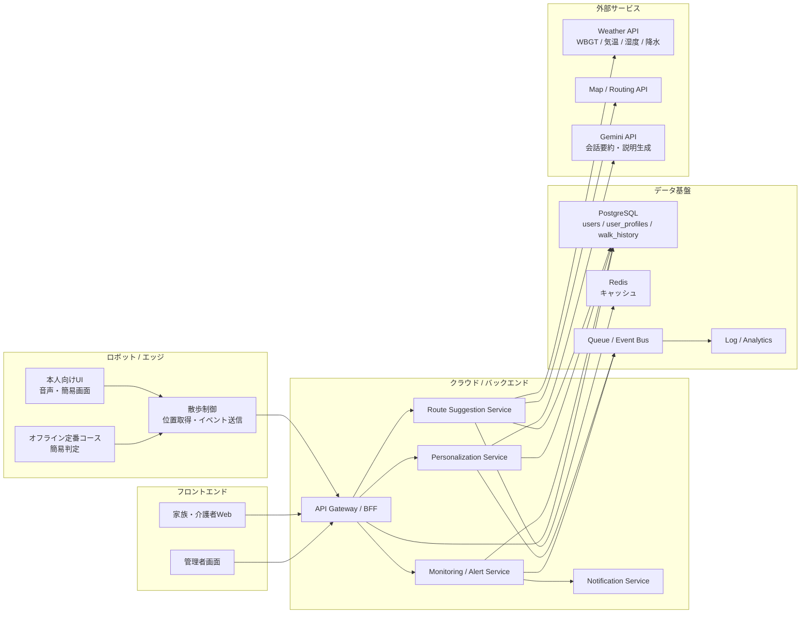

# お散歩ペットロボットの理想システム構成

## 1. 結論

このプロダクトでは、`ロボット側でリアルタイム制御`、`クラウド側で提案と学習`、`家族・介護者向けに見守りUI` を分ける構成が理想。

理由は以下。

- 散歩中の安全判断は通信断に耐える必要がある
- 天気、履歴、経路提案はクラウド集約の方が扱いやすい
- 高齢者本人向けUIと家族向けUIは責務が違う
- 将来の見守り通知や感情推定を自然に追加できる

## 2. 役割分担

### ロボット側

- 現在位置取得
- リードやモーターなどのリアルタイム制御
- 散歩開始、休憩、終了のイベント送信
- クラウドから受けた経路提案の提示
- オフライン時の定番コース提案

### フロントエンド

#### 高齢者本人向けUI

- 今日の散歩提案表示
- 音声または簡易画面での確認
- 散歩後の「疲れた」「楽しかった」入力

#### 家族・介護者向けUI

- 現在の散歩状況確認
- 過去の散歩履歴確認
- 危険時通知の受信
- 定番コースや慎重度設定の変更

### バックエンド

- ルート提案 API
- 散歩履歴登録 API
- user_profile 更新処理
- 天気、地図、履歴を使った経路スコアリング
- 見守りイベント処理

## 3. MVP 構成

最初は以下で十分。

- ロボットアプリ
- 家族向け Web ダッシュボード
- TypeScript バックエンド API
- PostgreSQL
- 天気 API
- 地図 API

## 4. 理想構成の関係図



## 5. 推奨フロント構成

### 5.1 高齢者本人向け

理想はロボット組み込みUIか、ロボットとつながる専用アプリ。

- 文字量は少なくする
- 音声を主にする
- 今日は行く / やめる / 少しだけ、のような少数選択にする
- 疲労入力も 5 段階程度に単純化する

候補技術。

- ロボット本体に組み込むなら Flutter
- タブレットやスマホ連携なら Flutter または React Native

### 5.2 家族・介護者向け

こちらは通常の Web ダッシュボードでよい。

- 今日の状態
- 現在位置または最終位置
- 危険通知
- 散歩履歴
- user_profile 設定

候補技術。

- Next.js
- React + TypeScript
- 地図表示は Mapbox GL JS か Google Maps

## 6. 推奨バックエンド構成

### 6.1 API 層

TypeScript はここで使うのが自然。

- 経路提案 API
- 散歩履歴登録 API
- user_profile 取得更新 API
- 見守り通知 API

候補技術。

- Node.js + TypeScript
- NestJS か Fastify

高齢者向けで説明責任があるので、経路判定は LLM ではなく通常の業務ロジックで持つ。

### 6.2 ドメインサービス

- `RouteSuggestionService`
- `PersonalizationService`
- `WeatherService`
- `RoutingService`
- `MonitoringService`

初期はモノリスでもよいが、責務はサービス単位で分けておく。

### 6.3 非同期処理

以下は同期 API から切り離すと扱いやすい。

- 散歩履歴登録後の user_profile 更新
- 通知送信
- 分析ログ集計
- 将来の感情推定後処理

## 7. データの流れ

### 散歩前

1. ロボットが現在地を送る
2. バックエンドが天気 API と user_profile と定番コースを参照する
3. Route Suggestion Service が提案経路を決定する
4. ロボットへ「推奨案 + 理由 + 代替案」を返す

### 散歩中

1. ロボットが位置、休憩、速度低下などをイベント送信する
2. 異常兆候があれば Monitoring Service が検知する
3. 必要なら家族へ通知する

### 散歩後

1. ロボットやUIから疲労度、満足度を登録する
2. `walk_history` に保存する
3. Personalization Service が `load_score` を計算する
4. `user_profiles` を更新する

## 8. MVP と理想形の違い

### MVP でやること

- バックエンドは 1 つの TypeScript API サーバでまとめる
- DB は PostgreSQL のみ
- 非同期は最初は同期処理でもよい
- ロボットがなければ仮のスマホUIで代替する
- 家族向けUIは最低限の履歴確認のみ

### 理想形で追加すること

- Redis キャッシュ
- Queue / Event Bus
- 通知基盤
- ログ分析基盤
- 感情推定や会話要約の LLM 補助
- オフライン判定強化

## 9. 実装方針のおすすめ

現時点では、以下の構成が最も現実的。

```text
[Robot App / Simulator]
        |
        v
[TypeScript Backend API]
        |
        +-- PostgreSQL
        +-- Weather API
        +-- Map API
        +-- Gemini API (任意)
        |
        v
[Family Dashboard]
```

この構成なら、MVP を早く作りつつ、あとで以下を足しやすい。

- 見守り通知
- 感情推定
- より高度なパーソナライズ
- ロボット固有ハード制御

## 10. コンポーネント対応表

| 領域 | 役割 | 推奨技術 |
|---|---|---|
| ロボットUI | 本人への提案表示、入力 | Flutter または組み込みUI |
| 家族向けUI | 履歴、見守り、設定 | Next.js |
| API | クライアント受付 | Node.js + TypeScript |
| 経路提案 | 天気、履歴、地図の統合 | TypeScript サービス |
| パーソナライズ | `load_score` 計算と profile 更新 | TypeScript サービス |
| DB | ユーザー、履歴、設定 | PostgreSQL |
| キャッシュ | 天気・経路特徴量 | Redis |
| 外部AI | 要約、説明生成 | Gemini API |

## 11. 設計上の重要ポイント

- 安全判定はクラウド依存にしすぎず、ロボット側に最低限の退避ロジックを持たせる
- 高齢者本人向けUIは高機能より単純さを優先する
- 家族向けUIと本人向けUIは分離する
- 散歩提案ロジックはバックエンド TypeScript に寄せる
- LLM は補助用途に限定し、コア判定から切り離す
